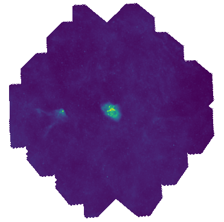

This is a thresholding+inpainting toolkit for astronomic photometric images. The different scripts allows for the identification of ROI in photometric images using an Otsu thresholding and different interpolation schemes for the filling of the masked ROI based on bilinear interpolation and patch-based inpainting techniques based on Criminisi et. al (2005) https://www.irisa.fr/vista/Papers/2004_ip_criminisi.pdf 

#### ROI_GEN.py
ROI_GEN.py is an interactive background thresholder used to generate the region of interest (ROI) in the image. This ROI will be masked for background removal or any other manipulation. 

# Usage
`python ROI_GEN.py -fn  -mode
  -fn, --file_name          fits file name
  -m , --mode               otsu for Otsu thresholding, rect for rectangular mask`
